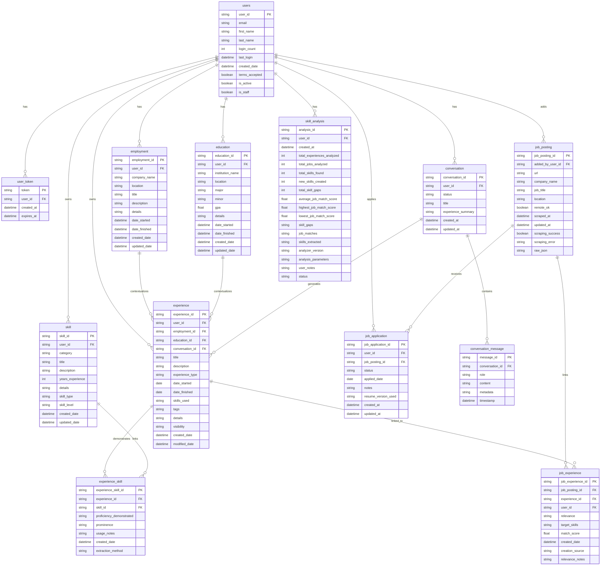

# Django Interview Assistant - Database ERD

## Key Database Design Patterns

### 1. **UUID Primary Keys**
- All main models use UUID primary keys for global uniqueness
- Prevents ID guessing and supports distributed systems
- Example: `user_id`, `experience_id`, `job_posting_id`

### 2. **User-Scoped Data**
- All user data is isolated via foreign key relationships to `users`
- Ensures data privacy and supports multi-tenant architecture
- All queries should filter by `user_id` for security

### 3. **Flexible JSON Storage**
- `raw_json` in JobPosting stores scraped job data and AI analysis
- `details` fields store flexible metadata without schema changes
- `skills_used`, `tags` arrays in Experience for dynamic categorization
- `target_skills`, `skill_gaps` for job matching analysis

### 4. **Many-to-Many Through Models**
- `experience_skill`: Links experiences to skills with additional context
- `job_experience`: Links experiences to jobs with relevance scoring
- Allows storing relationship-specific metadata

### 5. **Optional Context Relationships**
- Experience can optionally link to Employment or Education
- Supports both structured (job-based) and standalone experiences
- `conversation_id` tracks AI-generated experiences

### 6. **Job Application Pipeline**
- `job_application.status` tracks application progress
- `job_experience` links relevant experiences to specific jobs
- `match_score` quantifies experience-job fit

### 7. **AI Integration Architecture**
- Conversation system for interactive experience extraction
- Skill analysis with cached results and progress tracking
- JSON fields store AI analysis results to avoid re-processing

### 8. **Performance Optimizations**
- Composite indexes on frequently queried fields
- `db_index=True` on searchable fields (company_name, job_title)
- Optimized for user-scoped filtering patterns

## Critical Relationships

1. **Experience ← → Skills**: Many-to-many through ExperienceSkill
2. **Experience ← → Jobs**: Many-to-many through JobExperience  
3. **User → Everything**: One-to-many ownership pattern
4. **Employment/Education → Experience**: Optional context relationships
5. **Conversation → Experience**: AI generation tracking
6. **JobPosting → JobApplication**: Application tracking